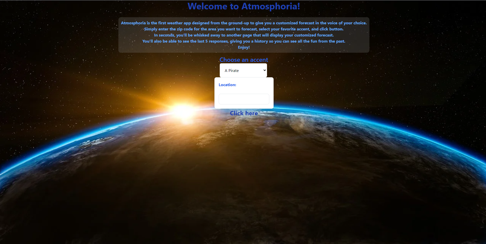
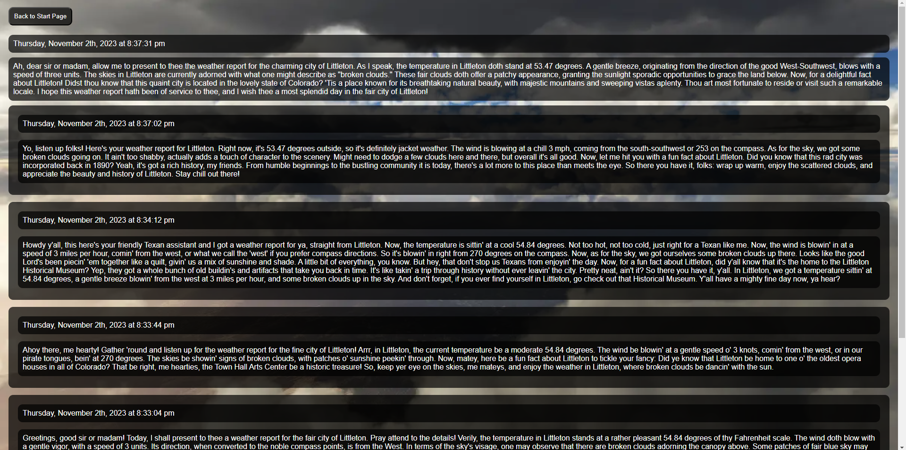

# Atmosphoria

## Description
Atmosphoria is designed to take in your preferences of an accent and a location from the landing page form to then push that information into the ChatGPT API to return the OpenWeather API weather report in the chosen accent. Below the current weather report, are the five most recent weather reports alongside their timestamps.

## Usage
Use the weather application by entering your choice of an accent and a ZipCode you want to retrieve the weather data for.

## Feature APIs
Weather API - https://openweathermap.org/api  
ChatGPT - https://openai.com  
CSS Tailwind - https://tailwindcss.com/docs/installation  

## License
MIT License

## Contributers
Alexander - https://github.com/alexilson  
Mark - https://github.com/MarkRBishop  
Michael - https://github.com/Carmetlo  
Lizzie - https://github.com/laude-noctis  

## Link and Screenshot
Link: https://alexilson.github.io/atmosphoria/  
  
  