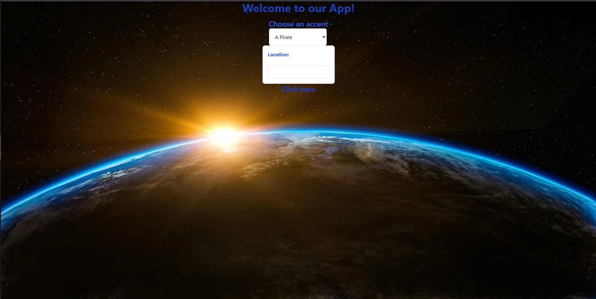

# Atmosphoria

## Description
This weather app is designed to give you your current weather in an accent of your choosing and give you a fact about the area. When it returns the results, if applicable, it will also display the previous 5 weather reports.

## Usage
Use the weather application by entering your choice of accent and area code you want to retireve weather data for.

## Feature APIs
Weather API - https://openweathermap.org/api  
ChatGPT - https://openai.com  
CSS Tailwind - https://tailwindcss.com/docs/installation  

## License
MIT License

## Contributers
Alexander - https://github.com/alexilson  
Mark - https://github.com/MarkRBishop  
Michael - https://github.com/Carmetlo  
Lizzie - https://github.com/laude-noctis  

## Link and Screenshot
Link: https://alexilson.github.io/atmosphoria/  
  
  